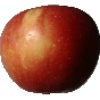

# Apple Identification - Image Recognition Projec

## Overview / Business Problem
The stakeholder is Mott’s, a nationally recognized fruit supplier and produced. Mott’s which operates under license by C.H. Robinson, an even larger, global supplier of fresh fruit and vegetables. While Mott’s offers several variations of fruit products, a vast majority of their goods rely solely on apples. With companies off Mott’s size, production factories will typically process hundreds of thousands of fruits daily. At present, Mott’s and other fruit/vegetable suppliers rely on farmers to deliver goods organized by variety or type of apple, for example. However, with hectic harvests and tight delivery/shipping deadlines, it is common for organization of goods to suffer. As such, Mott’s seeks a model that will aid workers with effectively categorizing apples to ensure the fruit will be correctly distributed to products. This project will provide Mott’s with a model which utilizes neural network image recognition in order to be able to visually recognize an apple’s variety. By implementing this model, Mott’s will be able to efficiently recognize apples being processed and efficiently streamline its organization process.

## Data Understanding
[The data] (https://www.kaggle.com/datasets/moltean/fruits) set comes from Kaggle, a data sharing site. The data was originally contained 24 different fruit and vegetable varieties, totaling at about 103,000 images. However, this model only includes an analysis of apples and as such contained ~3,800 photos total. The data set’s images were organized into three separate folders, a train, a test, and a validation folder. Approximately 65% of the photos were found in the train folder, about 25% of the photos were in the test folder, and the remaining 10% were found in the validation folder. Each variety of apple contained a range of between 600 and 650 for each apple variety. The apple varieties included are Braeburn Crimson Snow, Golden Delicious, Granny Smith, Pink Lady, and Red Delicious. Below is a sample image of a Braeburn apple from the data set.

## Modeling
As previously mentioned, the data set includes six different apple varieties – Braeburn (red), Crimson Snow (red), Golden Delicious (green), Granny Smith (green), Pink Lady (red), and Red Delicious (red). To effectively analyze these images, we will utilize a neural network model and tune parameters to maximize accuracy scores and minimize loss. Throughout this project, we utilize variations of a Sequential model and Image Data Generators. In aggregate, there were three models (including the baseline) that were ran. The second and third model were each ran with the augmented and non-augmented data sets to demonstrate the differences between the two.

### Final Model
Considering each model ran, the ‘final model’ for the stakeholder was the third model which utilized the data set with augmented images. The scores achieved with this model were a train accuracy and loss of ~99% and 0.2, respectively, and a test accuracy and loss of ~80% and 2, respectively. There was a third model that was ran with the same parameters with just non-augmented images which performed with high scores (a train accuracy of ~100% and a test accuracy and loss of ~96%). However the model with augmented images was deemed as the final model as it is believed to better serve the stakeholder. With augmented images the model is training on a more realistic data set when considering apples on a conveyor.

## Recommendation
As previously mentioned, it is recommended that the stakeholder, Mott’s, utilizes the final, third model, which took into account the augmented image data set. Based the model, it appears as though Mott’s utilizing this model, will correctly identify ~80% of apples which fall into the six varieties of apples – Braeburn, Crimson Snow, Golden Delicious, Granny Smith, Pink Lady, and Red Delicious. As previously mentioned, Mott’s current categorization system heavily relies on farmers to correctly organize deliveries (which is not always the case) with workers visually ‘spot checking’ the apples that are passed through production plants. Although the final model is not perfectly accurate, a model with an about 80% accuracy will effectively aid Mott’s with streamlining the current categorization process. By implementing this model, the process will require less work force to visually inspect apples and ultimately save Mott’s considerably on labor costs.

## Next Steps:
Further criteria and analyses could yield additional insights to further inform the stakeholder by:
- **Utilizing additional images and collect real-world data.** The stakeholder should consider utilizing a data set in addition, particularly images that are representative of apples in a Mott’s factory. Images including those of apples on a conveyor belt, or images with several apples in a single image would allow for the model to continuously train on these images and ultimately produce higher training and testing accuracy scores.
- **Adding additional apple varieties.** Another factor the stakeholder should consider is including data of other apple varieties. As previously mentioned, Mott’s processes upwards of hundreds of thousands of apples a day. These apples are not limited to the six varieties analyzed in this model. Therefor it would be beneficial with additional time for the stakeholder to consider utilizing data of other apple types.
- **Considering other apple characteristics.** Lastly, the stakeholder should consider other apple characteristics to analyze with the model. At present, the model is taking into account only certain visual characteristics of each apple type. Other characteristics, particularly feel/texture are very telling of an apple’s variety through its skin. By factoring in these other attributes the model would only further train and become more accurate when review unseen data.